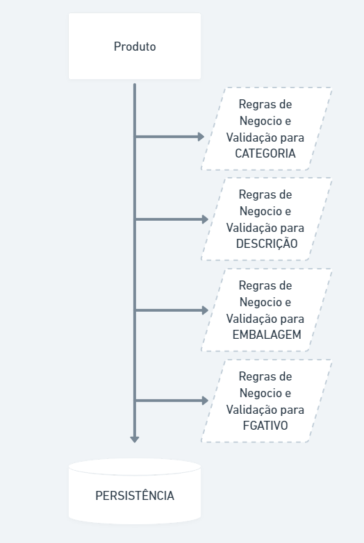
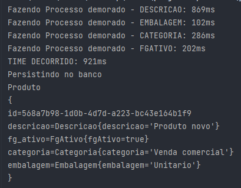

# Concorrência com Java

Em processo de aprendizado acabei ficando encantado como o Go Lang gerencia suas Goroutines, e resolvi praticar com Java.

A ideia é simples, fingindo uma persistência de um produto simulando processos pesado de regras de negocios e validações.

## INICIALIZAR
 Para testar, é necessário clonar o projeto e inicializar com uma IDE, ou com cmd.

## Demonstração

